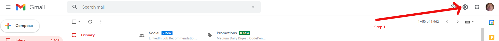
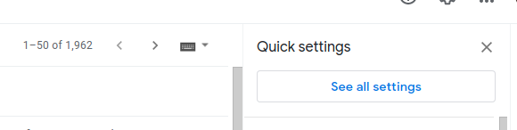

#code get momo transaction history
 
##how to using 
 
*step 1:
 
>go to gmail -> setting 
 

 
*step 2:
 
  *choose See all settings
   
  *
 
*step 3:
 
  *enable POP/IMAP
 
*step4:
 
  *run !!!!
 
  *php momo_api.php
